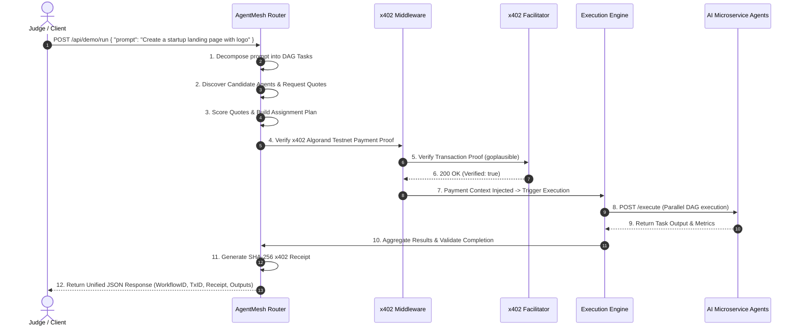

# AgentMesh — Hackathon Judge Walkthrough & System Architecture Guide

Welcome to **AgentMesh**! AgentMesh is a decentralized, pay-per-use AI agent orchestration platform that breaks down complex user prompts, discovers candidate AI agents, scores quotations, settles payments on **Algorand Testnet** (USDC ASA) via official **x402 protocol standards**, and executes tasks across specialized microservice agents.

---

## 1. System Architecture & Component Diagram

```mermaid
graph TD
    Client["Client App / Dashboard"] -->|1. POST /api/demo/run| Orchestrator["WorkflowOrchestrator"]
    
    subgraph Router Service (Spring Boot)
        Orchestrator -->|2. Generate DAG| Planner["WorkflowPlanner & Rules Engine"]
        Orchestrator -->|3. Discover Agents| Discovery["Discovery Service & Registry"]
        Orchestrator -->|4. Request Quotes| QuoteCollector["Quote Collection Engine"]
        QuoteCollector -->|Score Candidates| ScoringEngine["Multi-Criteria Scoring Engine"]
        Orchestrator -->|5. Generate Assignments| AssignmentPlanner["Assignment Planner"]
        Orchestrator -->|6. Verify Payment| X402Provider["Algorand x402 Provider"]
        X402Provider -->|7. Verify Proof| Facilitator["x402 Facilitator (goplausible)"]
        Orchestrator -->|8. Execute Tasks| ExecutionEngine["Workflow Execution Engine"]
        ExecutionEngine -->|Parallel DAG| ParallelEngine["Parallel Execution Engine"]
        ParallelEngine -->|9. Result Aggregation| Aggregator["Result Aggregator & Validator"]
    end

    subgraph Agent Microservices Network (FastAPI)
        ParallelEngine -->|POST /execute| Agent1["Research Agent (8001)"]
        ParallelEngine -->|POST /execute| Agent2["Coding Agent (8002)"]
        ParallelEngine -->|POST /execute| Agent3["Image Agent (8003)"]
        ParallelEngine -->|POST /execute| Agent4["PPT Agent (8004)"]
        ParallelEngine -->|POST /execute| Agent5["Testing Agent (8005)"]
    end
```

---

## 2. Protocol Sequence Diagram (End-to-End Flow)



---

## 3. Judge Walkthrough — Quick Start (One-Click Demo)

### Option A: Execute End-to-End Demo Request via `curl`

Run this single command to trigger the complete pipeline automatically:

```bash
curl -X POST http://localhost:8080/api/demo/run \
  -H "Content-Type: application/json" \
  -d '{"prompt": "Create a startup landing page with logo, presentation deck, and automated QA"}'
```

#### Expected JSON Output Structure:

```json
{
  "success": true,
  "message": "End-to-end workflow pipeline completed successfully",
  "data": {
    "workflowId": "wf-plan-a1b2c3d4",
    "executionId": "exec-98765432",
    "transactionId": "TX-ALGO-DEMO-12345",
    "receipt": {
      "workflowId": "wf-plan-a1b2c3d4",
      "executionId": "exec-98765432",
      "algorandTransactionId": "TX-ALGO-DEMO-12345",
      "asset": "USDC",
      "amount": "4.50",
      "receiptHash": "8f12a3b4c5d6e7f8901234567890abcdef1234567890abcdef1234567890abcd",
      "facilitatorStatus": "VERIFIED_BY_PLAUSIBLE_FACILITATOR",
      "verified": true,
      "paymentStatus": "SETTLED"
    },
    "executionTimeMs": 1450,
    "selectedAgents": [
      {
        "taskId": "task-research",
        "taskName": "Market & User Domain Research",
        "requiredCapability": "RESEARCH",
        "selectedAgentId": "agent-research-01",
        "selectedAgentName": "Research & Market Intelligence Agent",
        "quotedPrice": 45.0,
        "estimatedDuration": 10
      }
    ],
    "result": {
      "status": "COMPLETED",
      "aggregatedOutput": "# AgentMesh Workflow Summary Report..."
    },
    "timeline": {
      "planningStarted": 1785321000000,
      "planningCompleted": 1785321000010,
      "discoveryCompleted": 1785321000015,
      "quoteCollectionCompleted": 1785321000100,
      "assignmentCompleted": 1785321000110,
      "paymentVerified": 1785321000120,
      "executionStarted": 1785321000130,
      "executionCompleted": 1785321002450
    }
  }
}
```

---

## 4. System Health & Telemetry Endpoints

### System Status
`GET /api/system/status`
Returns real-time component health for Planner, Registry, Discovery, Quote Engine, Execution Engine, x402 Middleware, and Algorand Provider.

### Global Telemetry Metrics
`GET /api/system/metrics`
Returns revenue in USDC, settlement time averages, active workflows, running tasks, success rates, and registered agents.

---

## 5. Local Setup & Docker Instructions

```bash
# Clone Repository
git clone https://github.com/anuragpatil1729/algorand-smart-contract.git
cd algorand-smart-contract

# Run full local stack
./scripts/run.sh

# Run full unit & integration test suite
cd router-service && ./mvnw test
```
